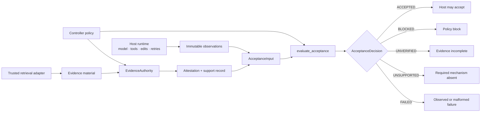
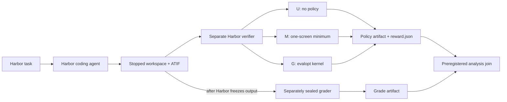

# Kernel boundary diagrams

The graph loop is a deprecated host adapter. The stable architecture is the smaller policy boundary:

Harbor integration keeps experiment ownership outside the kernel:

The grader runs after generation and policy-artifact freezing. Its result is separate and is never input
to the agent, observation builder, or kernel.
